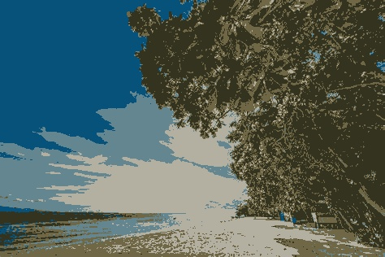

[](https://classroom.github.com/online_ide?assignment_repo_id=7831005&assignment_repo_type=AssignmentRepo)


# Image Segmentation
# RegionGrownig 
 ```
 A.  The way this function works is by the Getting  the RGP of each point and make an estimate of the box neigbour values 
	2. if the neighbours are near the value of the point (x,y) then add these points to the cluster
	3. after adding these points go to the bigger box 
	4. the way to get to bigger box is little tricky

B. we made a vectoer this vector is  is what makes the points 
	1. meaning the cluster should stop in points that doesn't justify the threeshold
	2. meaning this vector is the vectors of points that justify the threeshold from thier paast values
    3. Then Loop
```

- 

# Agglomerative 
```

A.Okay this function is super heavy in computinal wise
	1. the way this cluster works is like the same but instaead 3 major things changes
	

	2. first each pixel is clustered within pos , Values of RGB 
	3. second with each pixel not just neighbours
	4. the cluster is based as heical meaning after the first cluster 
	5. 2 things happen 
	6. One of the pixel get the cluster value
	7. while the second disappear or not mentioned any more

B. let the min 2 Points to be the value of them and add them to new image which makes sence because the cluster that is done
		1. will be used again to cluster the other while the other value stay the same 
		2. meaning we have 4 points for example nearest + min tyo each other
		3. the values will first cluster 1 , 2 making them the same color
		4. then 2 gets ignoreed as oif it doersn't exist anymore because the two became one cluster
		5. then 1 cluster with three making three has color differ from 1 so that means in this clusteringh
		6. we will see not just the high end ' or low roots but  allllllllllllllllll wiull be seen.

```
- 

# RBG TO LUV

```
Note:Part of the Image is croped due to its remain the same , well see in code
```
-  

- 

#  Mean Shift
 
|                       **Original**                        |              **Result**               |
| :---------------------------------------------------------------: | :------------------------------------------------------: |
|  |  |


#  K Means

* turn image into vector of pixles
 ```cpp
std::vector<BGR_point> createData(cv::Mat image) {
    int rows = image.rows;
    int cols = image.cols;
    std::vector<BGR_point> image_data;
    BGR_point point;
    for (int r = 0; r < rows; r++) {
        for (int c = 0; c < cols; c++) {
            point.b = image.at<cv::Vec3b>(r, c)[0];
            point.g = image.at<cv::Vec3b>(r, c)[1];
            point.r = image.at<cv::Vec3b>(r, c)[2];
            image_data.push_back(point);
        }
    }
    return image_data;
}
```
* generate random centroids 

```cpp

std::vector<BGR_point> RandomCentroidsGenerator(int number_of_centroids, cv::Mat image) {
    std::random_device rd;
    std::default_random_engine random_generator(rd());
    std::uniform_int_distribution<int> rows_distribution(0, image.rows);
    std::uniform_int_distribution<int> columns_distribution(0, image.cols);
    std::vector<BGR_point> centroids;
    for (int centroid_index = 0; centroid_index < number_of_centroids; centroid_index++) {
        bool centroid_far;
        BGR_point centroid;
        do {
            centroid_far = true;

            int row = rows_distribution(random_generator);
            int col = columns_distribution(random_generator);
            centroid.b = image.at<cv::Vec3b>(row, col)[0];
            centroid.g = image.at<cv::Vec3b>(row, col)[1];
            centroid.r = image.at<cv::Vec3b>(row, col)[2];

            for (int i = 0; i < centroids.size(); ++i) {
                double distance = BGR_distance(centroid, centroids[i]);

                if (distance <= MIN_CENTROID_DISTANCE) {

                    centroid_far = false;
                    break;
                }
            }
        } while (!centroid_far);
        centroids.push_back(centroid);
    }
    return centroids;
}
```
* calculate distance between pixel channels and each centroid
```cpp
int getClosestCluster(BGR_point point, std::vector<BGR_point> centroids) {
    double min_distance = BGR_distance(point, centroids[0]);
    int closest_cluster = 0;
    double distance;
    for (int cluster = 1; cluster < centroids.size(); cluster++) {
        distance = BGR_distance(point, centroids[cluster]);
        if (distance < min_distance) {
            min_distance = distance;
            closest_cluster = cluster;
        }
    }
    return closest_cluster;
}
```
* assign pixel to closest cluster
```cpp
std::vector<int>assignClusters(std::vector<BGR_point> image_data, std::vector<BGR_point> centroids) {
    int n_samples = image_data.size();
    int cluster_index = 0;
    std::vector<int> clusters_vector;
    for (int i = 0; i < n_samples; i++) {
        cluster_index = getClosestCluster(image_data[i], centroids);
        clusters_vector.push_back(cluster_index);
    }
    return clusters_vector;
}
```
* modify centroid
```cpp
std::vector<BGR_point> updateCentroids(std::vector<BGR_point> image_data, std::vector<int> clusters, std::vector<BGR_point> centroids) {
    std::vector<BGR_point> new_centroids;
    for (int c = 0; c < centroids.size(); c++) {
        BGR_point point;
        point.b = 0;
        point.g = 0;
        point.r = 0;
        int cluster_count = 0;
        for (int im = 0; im < image_data.size(); im++) {
            if (clusters[im] == c) {
                point.b += image_data[im].b;
                point.g += image_data[im].g;
                point.r += image_data[im].r;
                cluster_count++;
            }
        }
        if (cluster_count > 0) {
            point.b /= cluster_count;
            point.g /= cluster_count;
            point.r /= cluster_count;
            new_centroids.push_back(point);
        }
        else {
            new_centroids.push_back(centroids[c]);
        }
    }
    return new_centroids;
}
```
* segment
```cpp

void segmentImage(cv::Mat image, KMeans_result& kmeans) {
    cv::Mat segmented_image = image.clone();
    int cols = image.cols;
    int rows = image.rows;
    for (int r = 0; r < rows; ++r) {
        for (int c = 0; c < cols; ++c) {
            segmented_image.at<cv::Vec3b>(r, c)[0] = kmeans.centroids[kmeans.clusters[r * cols + c]].b;
            segmented_image.at<cv::Vec3b>(r, c)[1] = kmeans.centroids[kmeans.clusters[r * cols + c]].g;
            segmented_image.at<cv::Vec3b>(r, c)[2] = kmeans.centroids[kmeans.clusters[r * cols + c]].r;
        }
    }
    kmeans.segmented_image = segmented_image;
}
```

the result for k = 5
 
|                       **Original**                        |              **Result**               |
| :---------------------------------------------------------------: | :------------------------------------------------------: |
|  |  |

| Name                | Sec | BN  |
| ------------------- | --- | --- |
| Ezzeldeen Esmail    | 1   | 50  |
| Noran ElShahat      | 2   | 40  |
| Moamen Gamal        | 2   | 11  |
| omar sayed          | 2   | 2   |
| Abdelrahman Almahdy | 1   | 45  |
